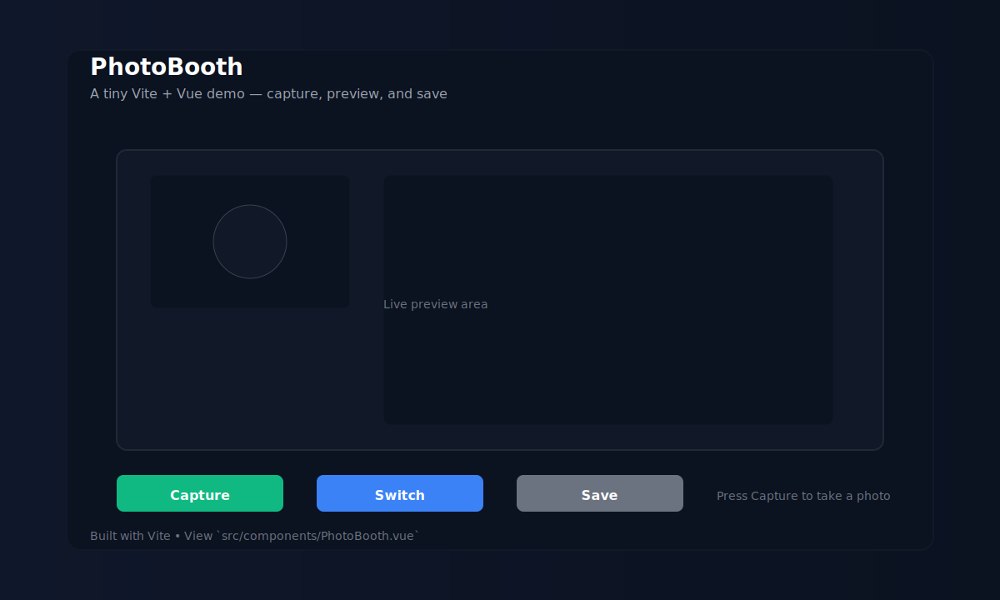

# PhotoBooth — cursor_test

A tiny demo app (built with Vite + Vue) that shows a simple PhotoBooth-style UI. This repository contains a minimal app for experimenting with camera/photo UI and a small component `PhotoBooth.vue` inside `src/components/`.

## Screenshot



## Why this repo

- Simple demo to prototype a camera/photo UI.
- Great starting point for adding webcam capture, filters, or file uploads.
- Minimal Vite + Vue setup so you can iterate quickly.

## Features

- Minimal PhotoBooth UI component
- Ready-to-run with Vite

## Tech stack

- Vite
- Vue
- Plain CSS

## Getting started

From the project root, run:

```bash
npm install
npm run dev
```

Open your browser at the address listed by Vite (usually `http://localhost:5173`).

## Project layout

- `index.html` — Vite entry
- `src/main.js` — App bootstrap
- `src/App.vue` — App container
- `src/components/PhotoBooth.vue` — The core component
- `style.css` — global styles

## Tips & next steps

- Add camera access and make the `PhotoBooth` component capture images using the MediaDevices API.
- Add tests and a couple of stories if you use Storybook.
- Add a small CI check to run linting and tests.

## License

MIT — feel free to reuse and adapt.

---

If you want the real live screenshot from the running app I can run the dev server and capture one for you — tell me if you'd like that (I can run it now and add a real PNG).
